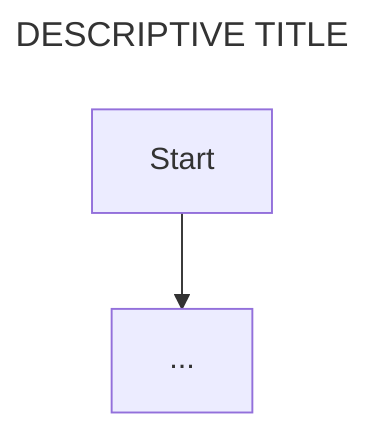

# [PROJECT NAME] Architecture

This document contains the architectural design of the solution with the focus on the high level components and how they interact. Use of the names and their appropriate technologies are required.

## High-level Component definitions & use

Descirbes the definitions and use of each component in the design, it's technology and the scope of the use of any services.

**System components**

**[Component Name]**

// description of component

**Core Functionality: [Component Name]**

- [Functionality 1]: functionality description
- [Functionality 2]: functionality description
- [Functionality 3]: functionality description

**Architectue Diagram of component: [Component Name]**

**[Component Name]**

// description of component

**Core Functionality: [Component Name]**

- [Functionality 1]: functionality description
- [Functionality 2]: functionality description
- [Functionality 3]: functionality description

**Architectue Diagram of component: [Component Name]**

