# Strategy: [TEAM NAME]


## Objectives

// overview description of the strategy exercises followed.

**Strategic objectives: [CUSTOMER]**

A set of strategic objectives that a client has raised as their main focus.

| objective | description | timelines |
|--|--|--|
| [OBJECTIVE] | // details | - [MILESTONE] | YYYY-MM-DD | //description |
| [OBJECTIVE] | // details | - [MILESTONE] | YYYY-MM-DD | //description |
| [OBJECTIVE] | // details | - [MILESTONE] | YYYY-MM-DD | //description |

**Values**

The set of core values to explain how we show up.

- [VALUE] | // description of value
- [VALUE] | // description of value
- [VALUE] | // description of value

**Challenges raised**

The challenges brought up by customers/users/stakeholders.

- [CHALLENGE] | // description of challenge
- [CHALLENGE] | // description of challenge
- [CHALLENGE] | // description of challenge

## Unpacking the Operation Verticals

**Operational Verticals**
The list of verticals that need to operationalize this strategy.

|| description |
|--|--|
| [VERTICAL NAME A] | //description of vertical A |
| [VERTICAL NAME B] | //description of vertical B |

**Relationships between verticals**

i.e. [VERTICAL NAME B] provides the following to [VERTICAL NAME A]:
- tools
- support


## [Winning aspiration]: Unpacking

**Decomposition of Winning aspiration: [NAME OF WINNING ASPIRATION]**

This shows how winning aspiration can be decomposed in to the values.

```mermaid
graph TD

```

Example:

```mermaid
graph TD
    %% Winning Aspiration (Level 1)
    WA["🎯 WINNING ASPIRATION<br/>Lead the iGaming industry by delivering<br/>innovative casino solutions through<br/>bold engineering and rapid market entry"]
    
    %% Core Values (Underpin everything)
    subgraph CV["Core Values"]
        CV1["🚀 Engineering Boldness"]
        CV2["⚡ Market Velocity"]
        CV3["💰 Revenue Innovation"]
    end
    WA --> CV1
    WA --> CV2
    WA --> CV3
```


## [Operational Vertical] Aspirations**

Breakdown of All aspirations for the given [Operational Vertical]. Showing how the aspirations, the Where to Play strategy, how to win, Capabilities and Systems

**Glossary of Terms**

- Segment of Customers | A definition of the segment of customers, stakeholders, users or client-tell for which the winning aspiration should be focused.
- How to Win (HTW)
- Where to Play (WTP)

**Aspiration Tree diagram: [WINNING ASPIRATION] by customer segments:**

Shows a high level break down of each aspiration within a given segment.

```
[Segment A of Customers/Stakeholders]
    - [WA1: //description]
        - [Focus Area related to Challenges]
            - //focus area
            - //focus area
        - [HTW: //description]
            - [WTP: //description]
                - [Opportunity: //name]
                    // description

                - [Necesary Truths]
                    1. //detail
                    2. Tools must be used to gain speed of execution
                    3. //detail
                    
                - [Value Proposition to customers: //name]
                    // description
 
                - [Barriers to Entry: //name]
                    1. //detail
                    2. Misaligned...
                    3. Lack of strategic decision making authority...
```

**[Operational Vertical] Playbook**

Show all the strategic options available to the [Operational Vertical] that follow the Playing to win strategy.

example:


## Strategic Initiatives and Implementation

outline the strategic initiatives using Objectives (O) and Key Results (KR)

**glossary:**

- Objective (O) | an Aspirational but achievable outcome that the team wants to accomplish.
- Key Results (KR) | a measurable result that along with other KRs can be combined to achieve objective

### Priority 1: [DESCRIPTION] ([ETA: Quarter & Year])

**OKR 1: [//name]: //description**

**Key Results:**

- **[KR1 //name]**
    **definition**: //definition
    **data points required**:
        - //detail
        - //detail
    **Tactics: [description]**:
    - //detail
    - deploy x
    - build y
    - add capability z

- **[KR2 //name]**
    **definition**: //definition
    **data points required**:
        - //detail
        - //detail
    **Tactics: [description]**:
    - //detail
    - deploy x
    - build y
    - add capability z

**OKR 2: [//name]: //description**

**Key Results:**

- **[KR1 //name]**
    **definition**: //definition
    **data points required**:
        - //detail
        - //detail
    **Tactics: [description]**:
    - //detail
    - deploy x
    - build y
    - add capability z

- **[KR2 //name]**
    **definition**: //definition
    **data points required**:
        - //detail
        - //detail
    **Tactics: [description]**:
    - //detail
    - deploy x
    - build y
    - add capability z

### Priority 2: [DESCRIPTION] ([ETA: Quarter & Year])

**OKR 1: [//name]: //description**

**Key Results:**

- **[KR1 //name]**
    **definition**: //definition
    **data points required**:
        - //detail
        - //detail
    **Tactics: [description]**:
    - //detail
    - deploy x
    - build y
    - add capability z

- **[KR2 //name]**
    **definition**: //definition
    **data points required**:
        - //detail
        - //detail
    **Tactics: [description]**:
    - //detail
    - deploy x
    - build y
    - add capability z

**OKR 2: [//name]: //description**

**Key Results:**

- **[KR1 //name]**
    **definition**: //definition
    **data points required**:
        - //detail
        - //detail
    **Tactics: [description]**:
    - //detail
    - deploy x
    - build y
    - add capability z

- **[KR2 //name]**
    **definition**: //definition
    **data points required**:
        - //detail
        - //detail
    **Tactics: [description]**:
    - //detail
    - deploy x
    - build y
    - add capability z


## Conclusion and Next Steps

// conclusion of strategic plan. Executive summary.

**Immediate Actions (Next [N] Days)**:
1. // detail 1
2. // detail 2
3. Initiate legacy system knowledge extraction project
4. Define rapid response team structure and recruitment plan

**Short-term Milestones (Next 3-6 Months)**:
1. // detail 1
2. // detail 2
3. Establish first rapid response teams
4. Begin legacy system sunset planning

**Long-term Vision (Next 12 Months)**:
1. // detail 1
2. // detail 2
3. Establish Engineering vertical as competitive differentiator for Product Office
4. Enable expansion into new gaming markets and revenue streams

