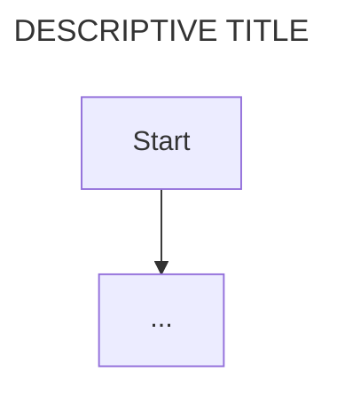

## [PROJECT NAME]

Note: make the use_case.md created is specific to the app code being documented. For example the auth should flow the type of auth implemented in the app. Each use-case should be specific to the app implementation.

**project directories**
- path/to/project1
- path/to/project2

// describe the project defined in the above paths.

## USE-CASE: [USE CASE TITLE i.e. user registeration]

**Feature 1: [FEATURE DESCRIPTION]**

|| definition |
|--|--|
| GIVEN ||
| WHEN ||
| THEN ||

**State Diagram: Logic flow within feature**

// short description of the stateDiagram below

```mermaid
---
title: [DESCRIPTIVE TITLE]
---
stateDiagram-v2
    [*] -->

```

**Sequence Diagram: Interactions between systems to enable Feature**

// short description of the flow chart below



**Data Entity Relationship: Data structure for entities in Feature**

// short description of data structures below

```mermaid
---
title: [DESCRIPTIVE TITLE]
---
erDiagram
...

```