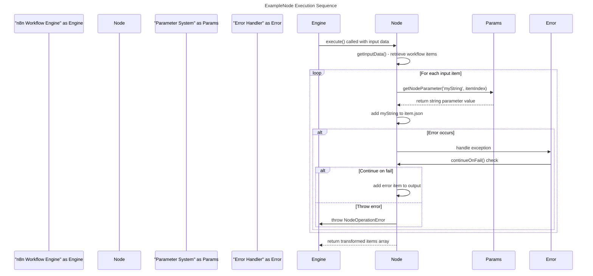
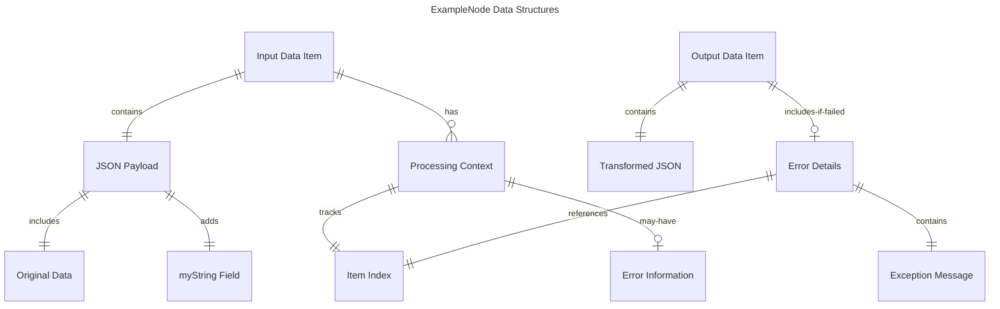
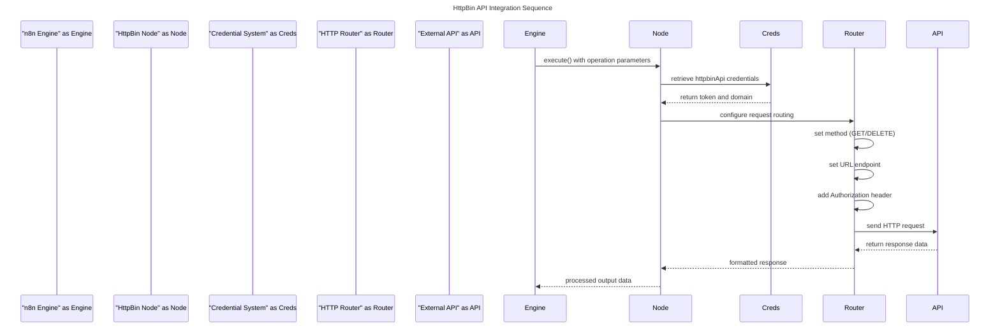
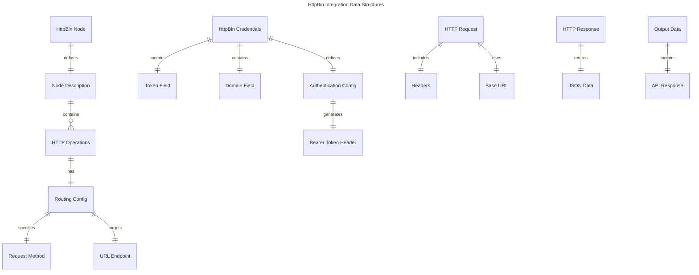
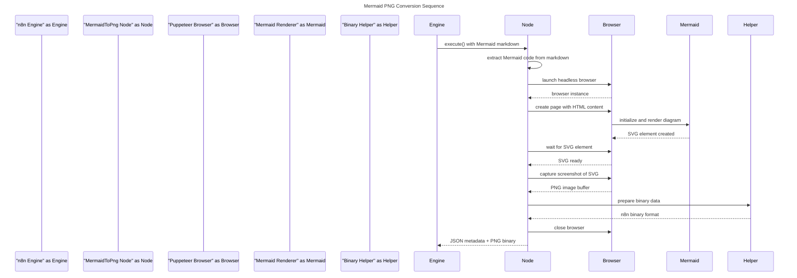
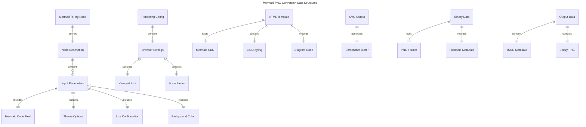
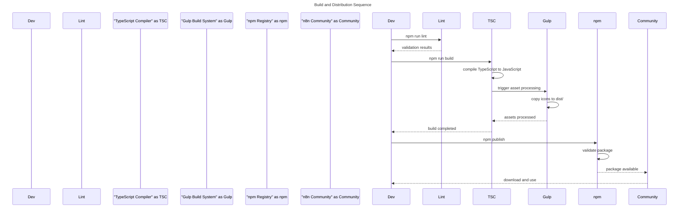
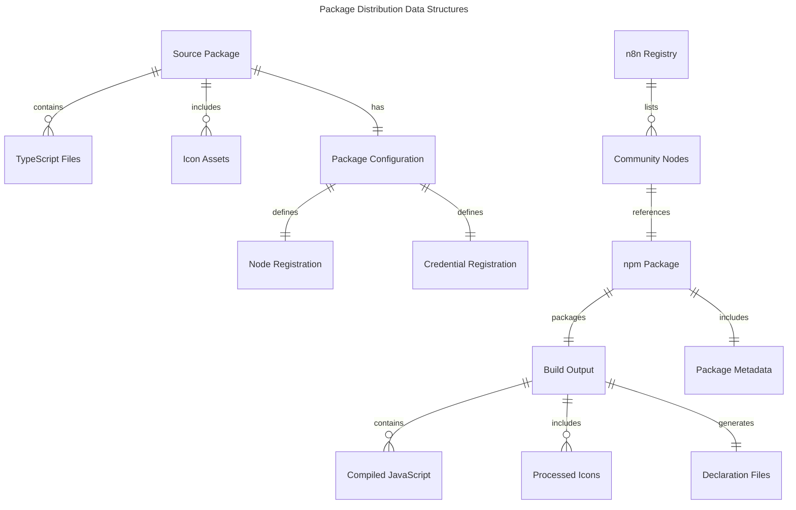

# n8n Nodes Starter Use Cases

**project directories**
- nodes/ - Contains custom node implementations with TypeScript classes
- credentials/ - Contains credential type definitions for API authentication
- dist/ - Compiled output directory for distribution packages

This project provides a starter template for developing custom n8n workflow automation nodes. It includes example implementations for basic data transformation and HTTP API integration nodes, along with corresponding credential management systems.

## USE-CASE: Custom Node Development and Testing

**Feature 1: Example Node Creation with String Transformation**

|| definition |
|--|--|
| GIVEN | A developer wants to create a custom n8n node that transforms string data |
| WHEN | They implement the ExampleNode.node.ts with INodeType interface and string parameter processing |
| THEN | The node processes input data, adds a custom string field to each item, and returns transformed output with error handling |

**State Diagram: Logic flow within feature**

State diagram showing the execution flow of the ExampleNode from initialization through data processing and output generation.

```mermaid
---
title: ExampleNode String Transformation State Flow
---
stateDiagram-v2
    [*] --> "Node Initialized"
    "Node Initialized" --> "Input Data Received"
    "Input Data Received" --> "Parameter Extraction"
    "Parameter Extraction" --> "Item Processing Loop"
    "Item Processing Loop" --> "String Parameter Applied"
    "String Parameter Applied" --> "JSON Object Updated"
    "JSON Object Updated" --> "More Items?"
    "More Items?" --> "Item Processing Loop" : Yes
    "More Items?" --> "Output Generated" : No
    "Output Generated" --> [*]
    "Parameter Extraction" --> "Error Handling" : Exception
    "Error Handling" --> "Continue on Fail?" 
    "Continue on Fail?" --> "Error Item Added" : Yes
    "Continue on Fail?" --> "Node Operation Error" : No
    "Error Item Added" --> "More Items?"
    "Node Operation Error" --> [*]
```

**Sequence Diagram: Interactions between systems to enable Feature**

Sequence diagram showing the interaction between n8n workflow engine, the custom node, and the parameter processing system.



**Data Entity Relationship: Data structure for entities in Feature**

Entity relationship diagram showing the data structures used in the ExampleNode processing pipeline.



## USE-CASE: HTTP API Integration with Authentication

**Feature 2: HttpBin Node with Credential Management**

|| definition |
|--|--|
| GIVEN | A developer needs to create an HTTP API integration node with authentication |
| WHEN | They implement HttpBin.node.ts with HTTP verb operations and HttpBinApi.credentials.ts for token authentication |
| THEN | The node performs authenticated HTTP requests (GET, DELETE) to external APIs with configurable parameters and credential injection |

**State Diagram: Logic flow within feature**

State diagram showing the HTTP request lifecycle with credential authentication and routing configuration.

```mermaid
---
title: HttpBin API Integration State Flow
---
stateDiagram-v2
    [*] --> "Node Configuration"
    "Node Configuration" --> "Credential Validation"
    "Credential Validation" --> "HTTP Operation Selected"
    "HTTP Operation Selected" --> "Request Parameters Set"
    "Request Parameters Set" --> "Authentication Headers Added"
    "Authentication Headers Added" --> "HTTP Request Sent"
    "HTTP Request Sent" --> "Response Received"
    "Response Received" --> "Data Processing"
    "Data Processing" --> "Output Generated"
    "Output Generated" --> [*]
    "Credential Validation" --> "Credential Error" : Invalid
    "HTTP Request Sent" --> "Network Error" : Failed
    "Credential Error" --> [*]
    "Network Error" --> [*]
```

**Sequence Diagram: Interactions between systems to enable Feature**

Sequence diagram showing the interaction between n8n, the HttpBin node, credential system, and external API.



**Data Entity Relationship: Data structure for entities in Feature**

Entity relationship diagram showing the data structures for HTTP operations, credentials, and routing configuration.



## USE-CASE: Mermaid Diagram to PNG Conversion

**Feature 4: MermaidToPng Node with Browser Rendering**

|| definition |
|--|--|
| GIVEN | A developer needs to convert Mermaid diagrams from markdown format to PNG images in n8n workflows |
| WHEN | They implement MermaidToPng.node.ts with Puppeteer browser rendering and configurable output options |
| THEN | The node processes Mermaid markdown code blocks, renders them as PNG images, and returns binary data for workflow automation |

**State Diagram: Logic flow within feature**

State diagram showing the Mermaid diagram rendering pipeline from markdown input to PNG binary output.

```mermaid
---
title: Mermaid to PNG Conversion State Flow
---
stateDiagram-v2
    [*] --> "Node Initialized"
    "Node Initialized" --> "Input Data Received"
    "Input Data Received" --> "Mermaid Code Extraction"
    "Mermaid Code Extraction" --> "Browser Launch"
    "Browser Launch" --> "HTML Page Creation"
    "HTML Page Creation" --> "Mermaid Rendering"
    "Mermaid Rendering" --> "SVG Element Wait"
    "SVG Element Wait" --> "Screenshot Capture"
    "Screenshot Capture" --> "Binary Data Creation"
    "Binary Data Creation" --> "Output Generated"
    "Output Generated" --> "Browser Cleanup"
    "Browser Cleanup" --> [*]
    "Mermaid Code Extraction" --> "Invalid Format Error" : No markdown blocks
    "SVG Element Wait" --> "Rendering Timeout" : Timeout
    "Screenshot Capture" --> "Capture Error" : Failed
    "Invalid Format Error" --> "Error Handling"
    "Rendering Timeout" --> "Error Handling"
    "Capture Error" --> "Error Handling"
    "Error Handling" --> "Continue on Fail?" 
    "Continue on Fail?" --> "Error Item Added" : Yes
    "Continue on Fail?" --> "Node Operation Error" : No
    "Error Item Added" --> "Browser Cleanup"
    "Node Operation Error" --> [*]
```

**Sequence Diagram: Interactions between systems to enable Feature**

Sequence diagram showing the interaction between n8n, the MermaidToPng node, Puppeteer browser, and Mermaid rendering engine.



**Data Entity Relationship: Data structure for entities in Feature**

Entity relationship diagram showing the data structures for Mermaid diagram processing, rendering configuration, and binary output.



## USE-CASE: Node Package Development and Distribution

**Feature 3: Build Pipeline and npm Publishing**

|| definition |
|--|--|
| GIVEN | A developer has completed custom node development and wants to distribute it |
| WHEN | They run the build pipeline with TypeScript compilation, ESLint validation, and Gulp asset processing |
| THEN | The system generates a distributable npm package with compiled nodes, processed assets, and proper n8n registration |

**State Diagram: Logic flow within feature**

State diagram showing the build and distribution pipeline from source code to published npm package.

```mermaid
---
title: Build and Distribution Pipeline State Flow
---
stateDiagram-v2
    [*] --> "Source Code Ready"
    "Source Code Ready" --> "ESLint Validation"
    "ESLint Validation" --> "TypeScript Compilation"
    "TypeScript Compilation" --> "Gulp Asset Processing"
    "Gulp Asset Processing" --> "Distribution Directory Created"
    "Distribution Directory Created" --> "Package Configuration"
    "Package Configuration" --> "npm Package Built"
    "npm Package Built" --> "Pre-publish Validation"
    "Pre-publish Validation" --> "npm Registry Upload"
    "npm Registry Upload" --> "Community Node Available"
    "Community Node Available" --> [*]
    "ESLint Validation" --> "Lint Errors" : Failed
    "TypeScript Compilation" --> "Compilation Errors" : Failed
    "Pre-publish Validation" --> "Validation Errors" : Failed
    "Lint Errors" --> [*]
    "Compilation Errors" --> [*]
    "Validation Errors" --> [*]
```

**Sequence Diagram: Interactions between systems to enable Feature**

Sequence diagram showing the build pipeline interaction between development tools and distribution systems.



**Data Entity Relationship: Data structure for entities in Feature**

Entity relationship diagram showing the package structure, build artifacts, and distribution metadata.


