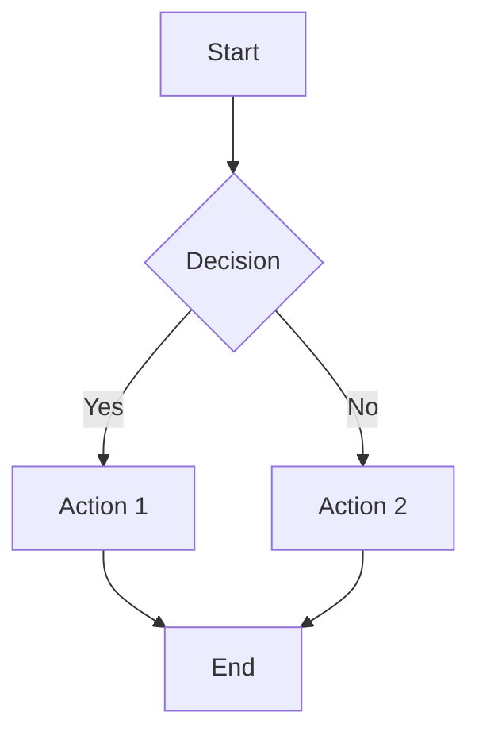
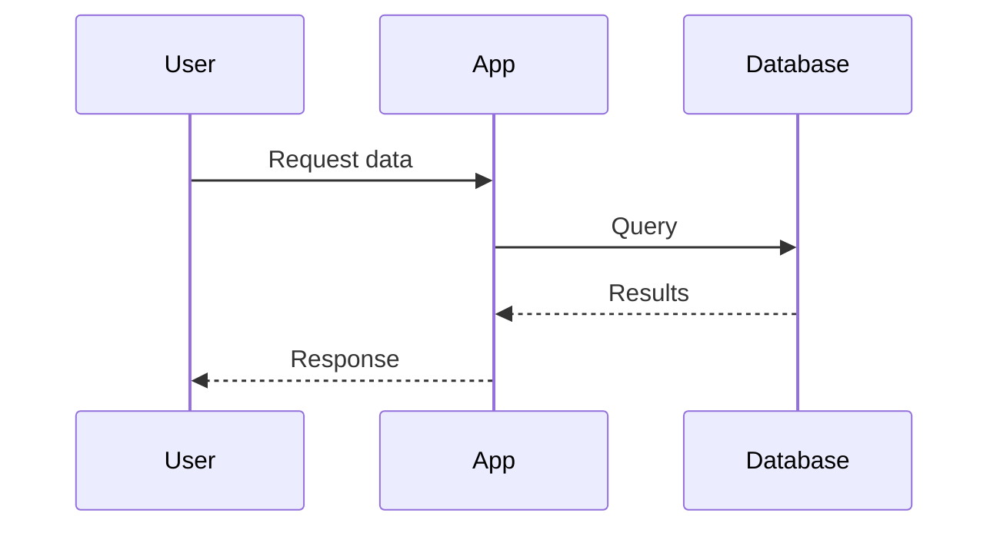
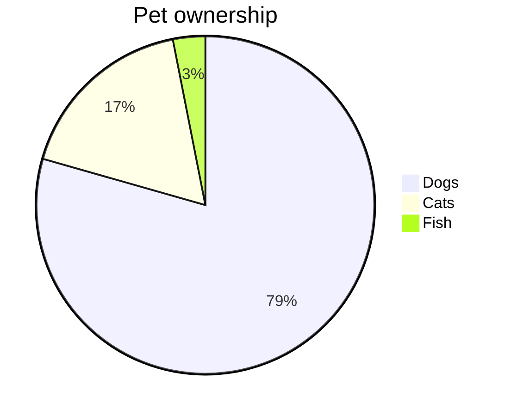

# MermaidToPng Node Test

This file can be used to test the MermaidToPng node in n8n.

## Test Input Examples

### Basic Flowchart


### State Diagram (User's Example)
```mermaid
stateDiagram-v2
    [*] --> "Configured"
    "Configured" --> "Started"
    "Started" --> "Running"
    "Running" --> "Completed"
    "Running" --> "Error"
    "Error" --> "Completed"
```

### Sequence Diagram


### Pie Chart


## Testing Instructions

1. Install the node package in your n8n instance
2. Create a new workflow
3. Add the "Mermaid to PNG" node
4. Paste one of the above examples into the "Mermaid Diagram" field
5. Configure the output options (theme, size, etc.)
6. Execute the workflow
7. The node should output binary PNG data that can be used by subsequent nodes

## Expected Output

The node should return:
- JSON data with metadata about the generated image
- Binary data containing the PNG image
- Error handling for invalid Mermaid syntax
